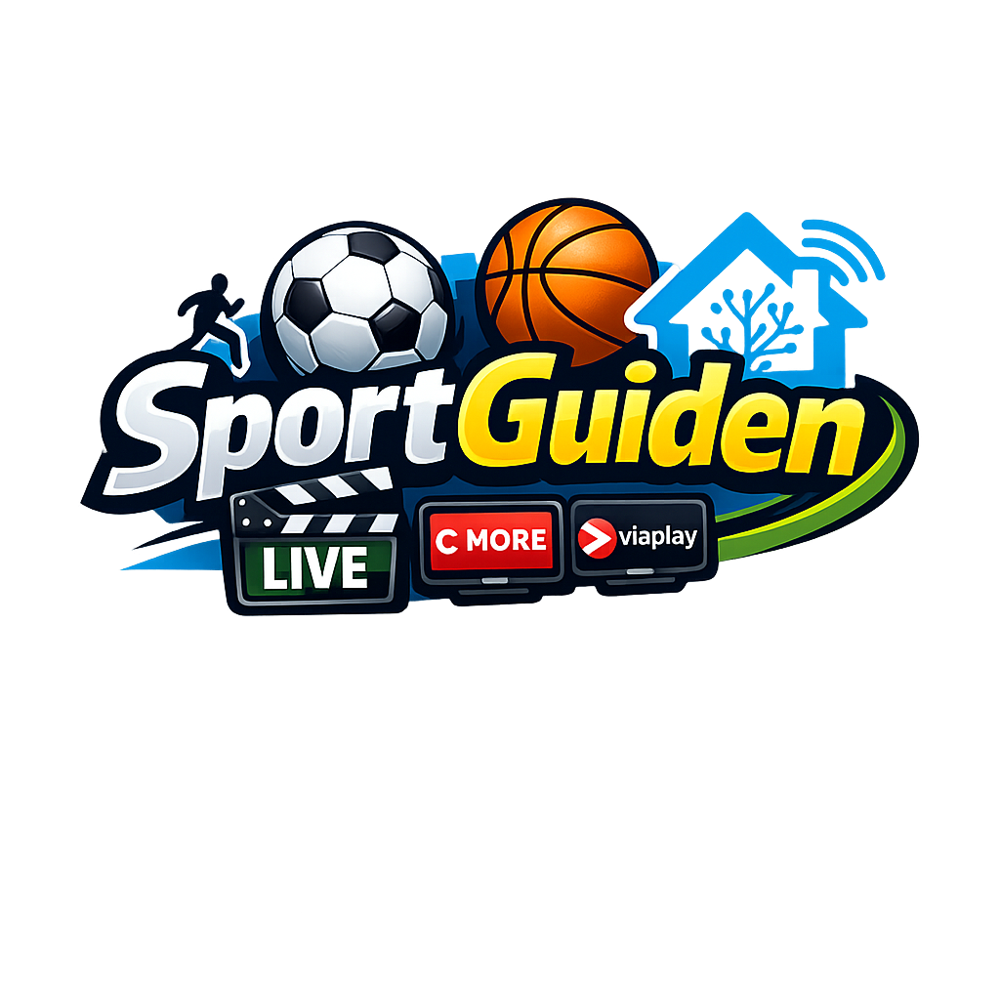
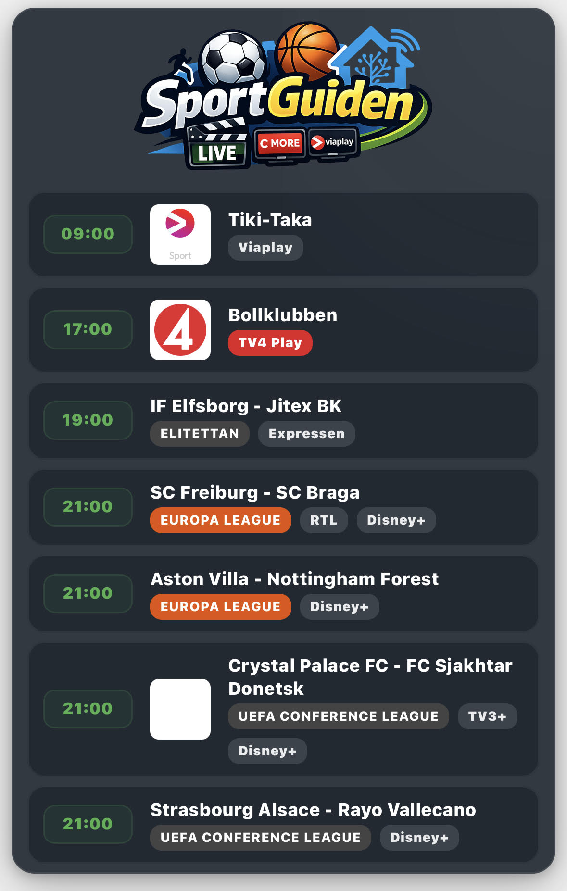

# SportGuiden

[](https://github.com/hacs/integration)

Home Assistant integration that shows today's live sport on TV and streaming in Sweden (via [tv.nu](https://www.tv.nu/sport)). Zero-config – install and go!



### Exempel på kort / Card example



## Features

- **Zero-config**: Install via HACS → Add integration → done. No YAML needed.
- **All sports, always**: The sensor fetches all sport categories automatically – football, ice hockey, tennis, motorsport, winter sports, golf, basketball, handball, cycling and more.
- **Sport filter**: Show only the sports you care about – select one or more categories directly in the card editor.
- **League & tournament filter**: Filter by Champions League, Allsvenskan, Premier League, SHL, etc.
- **Channel filter**: Pick which channels to show (SVT, TV4, Viaplay, Eurosport, Max, DAZN…).
- **Multiple cards, one sensor**: A single integration fetches all data – each card filters independently by sport, league and channel.
- **Channel logos**: Real logos for all Swedish sport channels, served locally (no external image URLs).
- **League badges**: Color-coded badges for known leagues and tournaments.
- **Visual editor**: Full GUI – no YAML knowledge required.
- **Themes**: Gradient, glass, solid or HA-theme backgrounds with custom colors and compact mode.
- **Nightly refresh**: Data is refreshed automatically at 04:00 every night (tv.nu schedules are complete by then) and on every HA restart.

## Installation

### HACS (recommended)

1. Go to **HACS → Integrations → ⋮ → Custom repositories**
2. Add `https://github.com/ostbergjohan/ha-sportguiden` as **Integration**
3. Search for **SportGuiden** and click **Download**
4. Restart Home Assistant
5. Go to **Settings → Devices & Services → Add Integration → SportGuiden**
6. Click **Submit** – that's it!

The sensor `sensor.sportguiden` is created automatically and the Lovelace card is registered.

## Add card to dashboard

Go to your dashboard → **Edit → Add Card → Custom: SportGuiden**.

The card editor opens with a full GUI. Minimum YAML:

```yaml
type: custom:sportguiden-card
entity: sensor.sportguiden
```

## Card options

All options are available in the visual editor. YAML reference:

### Basic

| Option | Type | Default | Description |
|--------|------|---------|-------------|
| `entity` | string | *required* | Sensor entity, e.g. `sensor.sportguiden` |
| `title` | string | `"🏆 Sport på TV idag"` | Card title. Leave empty to use the default. |
| `max_items` | number | `0` | Max events to show. `0` = show all. |

### Filters

| Option | Type | Default | Description |
|--------|------|---------|-------------|
| `sources` | list | `[]` | Sport categories to show. Empty = all sports. See [available sources](#available-sport-sources). |
| `leagues` | list | `[]` | League/tournament filter. Empty = show all. |
| `channels` | list | `[]` | Channel filter. Empty = show all. |

### Appearance

| Option | Type | Default | Description |
|--------|------|---------|-------------|
| `background` | string | `gradient` | `gradient`, `glass`, `solid`, or `none` (HA theme). |
| `accent_color` | string | `#667eea` | Primary accent color (time badges, count pill). |
| `accent_color_2` | string | `#764ba2` | Secondary gradient color. |
| `card_bg_color` | string | `#0f1923` | Card background color. |
| `text_color` | string | `#ffffff` | Text color. |

### Show / hide

| Option | Type | Default | Description |
|--------|------|---------|-------------|
| `show_time` | boolean | `true` | Show event time. |
| `show_channel_logo` | boolean | `true` | Show channel logo image. |
| `show_channel_name` | boolean | `true` | Show channel name as text badge (used when no logo, or as the only channel display when `show_channel_logo` is false). |
| `show_league` | boolean | `true` | Show league/tournament badge. |
| `show_header_icon` | boolean | `true` | Show SportGuiden logo in the card header. |
| `header_icon_size` | number | `80` | Size of the header logo in pixels. |
| `compact` | boolean | `false` | Compact mode – smaller padding and font sizes. |

### Channel display combinations

| `show_channel_logo` | `show_channel_name` | Result |
|---|---|---|
| ✓ | ✓ | Logo shown when available, text badge as fallback |
| ✓ | ✗ | Logo only – nothing shown if no logo exists |
| ✗ | ✓ | Always show text badge, never logo |
| ✗ | ✗ | No channel info shown |

## Examples

### All sports – quick overview

```yaml
type: custom:sportguiden-card
entity: sensor.sportguiden
title: "🏆 Sport på TV idag"
max_items: 10
```

### Football only

```yaml
type: custom:sportguiden-card
entity: sensor.sportguiden
sources:
  - fotboll
title: "⚽ Fotboll idag"
accent_color: "#4CAF50"
```

### Football + Ice hockey

```yaml
type: custom:sportguiden-card
entity: sensor.sportguiden
sources:
  - fotboll
  - ishockey
title: "Sport ikväll"
```

### Champions League & Premier League on Viaplay

```yaml
type: custom:sportguiden-card
entity: sensor.sportguiden
sources:
  - fotboll
title: "🏆 European football"
leagues:
  - Champions League
  - Premier League
channels:
  - Viaplay
accent_color: "#1a237e"
```

### All football on free TV (SVT & TV4)

```yaml
type: custom:sportguiden-card
entity: sensor.sportguiden
sources:
  - fotboll
title: "⚽ Fotboll på fri-TV"
channels:
  - SVT1
  - SVT2
  - SVT Play
  - TV4
  - TV4 Play
accent_color: "#2e7d32"
```

### Allsvenskan only

```yaml
type: custom:sportguiden-card
entity: sensor.sportguiden
sources:
  - fotboll
leagues:
  - Allsvenskan
title: "🇸🇪 Allsvenskan"
accent_color: "#002f6c"
```

### Ice hockey – SHL and NHL

```yaml
type: custom:sportguiden-card
entity: sensor.sportguiden
sources:
  - ishockey
title: "🏒 Hockey ikväll"
leagues:
  - SHL
  - NHL
accent_color: "#0288d1"
```

### Streaming only (Viaplay, Max, DAZN, Discovery+)

```yaml
type: custom:sportguiden-card
entity: sensor.sportguiden
title: "📺 Sport på streaming"
channels:
  - Viaplay
  - Max
  - DAZN
  - Discovery+
background: glass
```

### Motorsport – compact

```yaml
type: custom:sportguiden-card
entity: sensor.sportguiden
sources:
  - motorsport
title: "🏎️ Motorsport"
compact: true
accent_color: "#d32f2f"
```

### Channel names only (no logos)

```yaml
type: custom:sportguiden-card
entity: sensor.sportguiden
show_channel_logo: false
show_channel_name: true
```

## Available sport sources

The sensor always fetches all categories. Use `sources` in the card to filter what is displayed.

| Source ID | Display name | URL scraped |
|-----------|-------------|-------------|
| `fotboll` | Fotboll | tv.nu/sport/fotboll |
| `ishockey` | Ishockey | tv.nu/sport/ishockey |
| `tennis` | Tennis | tv.nu/sport/tennis |
| `motorsport` | Motorsport | tv.nu/sport/motorsport |
| `vintersport` | Vintersport | tv.nu/sport/vintersport |
| `golf` | Golf | tv.nu/sport/golf |
| `basket` | Basket | tv.nu/sport/basket |
| `handboll` | Handboll | tv.nu/sport/handboll |
| `cykling` | Cykling | tv.nu/sport/cykling |
| `ovrigt` | Övrig sport | tv.nu/sport/ovrigt |

## Channel logos

The following channels have local logos bundled with the integration:

SVT1, SVT2, TV4, TV4 Sport, Sportkanalen, Viaplay, V Sport 1, V Sport 2, V Sport Fotboll, TV3, TV6, TV8

For all other channels a color-coded text badge is shown as fallback (configurable via `show_channel_name`).

## League badges (color-coded)

The following leagues get a distinct color badge automatically:

Champions League, Europa League, Conference League, Premier League, Allsvenskan, Superettan, Damallsvenskan, Bundesliga, La Liga, Serie A, Ligue 1, FA Women's Super League, Svenska cupen, SHL, Hockeyallsvenskan, NHL, ATP, WTA, World Tour, PGA Tour

All other leagues/tournaments get a neutral dark badge.

## Data refresh

- **On startup / HA restart**: data is fetched immediately.
- **Daily at 04:00**: automatic nightly refresh (tv.nu schedules are finalized by then).
- **Fallback interval**: 24 hours (in case the nightly trigger is missed).

## Sensor attributes

The sensor `sensor.sportguiden` exposes the following attributes used by the card:

| Attribute | Description |
|-----------|-------------|
| `all_events` | All unique events across all sources (sorted by time) |
| `sources` | Per-category data: `{ fotboll: { events: [...], count: N, ... }, ... }` |
| `configured_sources` | List of source IDs and names fetched |
| `date` | Date the data was fetched |

The sensor state is the total number of unique events found.

## Requirements

- Home Assistant 2023.11+
- Internet access to tv.nu

## License

MIT
